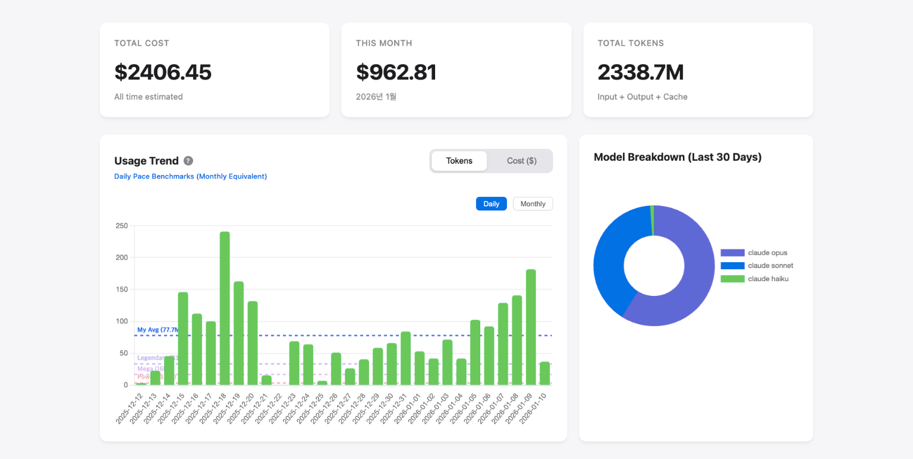

# ccusage-ui

Web UI dashboard for [Claude Code](https://claude.ai/code) usage statistics.

[](screenshot.png)


## Quick Start

```bash
npx ccusage-ui
```

Or install globally:

```bash
npm install -g ccusage-ui
ccusage-ui
```

## Features

- Daily/Monthly usage trend charts
- Model breakdown visualization
- Token usage and cost tracking
- User level tier display
  - 🟣 **Legendary (100M+)**: Opus 4.5 Class
  - 🟣 **Mega (50M+)**: Sonnet 4.5 Class
  - 🔴 **Power (10M+)**: Haiku 4.5 Class

## Requirements

- Node.js >= 20
- [Claude Code](https://claude.ai/code) usage data

## Related

- [ccusage](https://github.com/ryoppippi/ccusage) - CLI tool for Claude Code usage

## Author

**Doha Park** - Creator of [CrewX](https://crewx.dev)

> "Do you use Claude Code like an employee? Manage your whole AI team with CrewX."

[](https://x.com/dohapark81)
[](https://www.threads.net/@dohapark81)
[](https://www.linkedin.com/in/dohapark81/)

## Tier Icons

Tier icons were generated using **Gemini (via 나노바나나 프로)** and extracted with chroma key processing.

<details>
<summary>Image Generation Prompt</summary>

```
Create a 5x2 grid of League of Legends style tier icons.
Image aspect ratio: 5:2 (e.g., 2500x1000px or similar)
Each cell should be square and contain one icon, clearly separated with no effects bleeding between cells.

IMPORTANT - Background colors per cell (for chroma key extraction):
- Green (#00FF00): Challenger, Grandmaster, Master, Gold, Silver, Bronze, Iron
- Magenta (#FF00FF): Diamond, Emerald, Platinum (these have cyan/green colors, so use magenta background)

CRITICAL - DO NOT use these colors in the icons themselves:
- Icons with green background: DO NOT use pure green (#00FF00) or similar bright greens in the icon
- Icons with magenta background: DO NOT use pure magenta (#FF00FF) or similar magentas in the icon
- These colors are reserved for background removal (chroma key)

Grid layout (left to right):
- Row 1: Challenger(green bg), Grandmaster(green bg), Master(green bg), Diamond(magenta bg), Emerald(magenta bg)
- Row 2: Platinum(magenta bg), Gold(green bg), Silver(green bg), Bronze(green bg), Iron(green bg)

Icon descriptions (G=green bg, M=magenta bg):
1. Challenger (G) - Golden winged crown emblem with red gems
2. Grandmaster (G) - Red/orange flaming emblem with golden wings
3. Master (G) - Crimson red shield emblem with flame accents
4. Diamond (M) - Cyan/light blue crystalline shield emblem
5. Emerald (M) - Green gemstone shield emblem with facets
6. Platinum (M) - Silver-white metallic shield emblem with teal accents
7. Gold (G) - Golden shield emblem with warm yellow glow
8. Silver (G) - Silver metallic shield emblem with cool gray tones
9. Bronze (G) - Bronze/copper shield emblem with warm brown tones
10. Iron (G) - Dark gray iron shield emblem, simplest design

Icon style: metallic shields with gemstones, fantasy game aesthetic, detailed 3D rendering.
All icons should be shield/emblem shaped for visual consistency (like League of Legends rank badges).
```

</details>

## License

MIT
